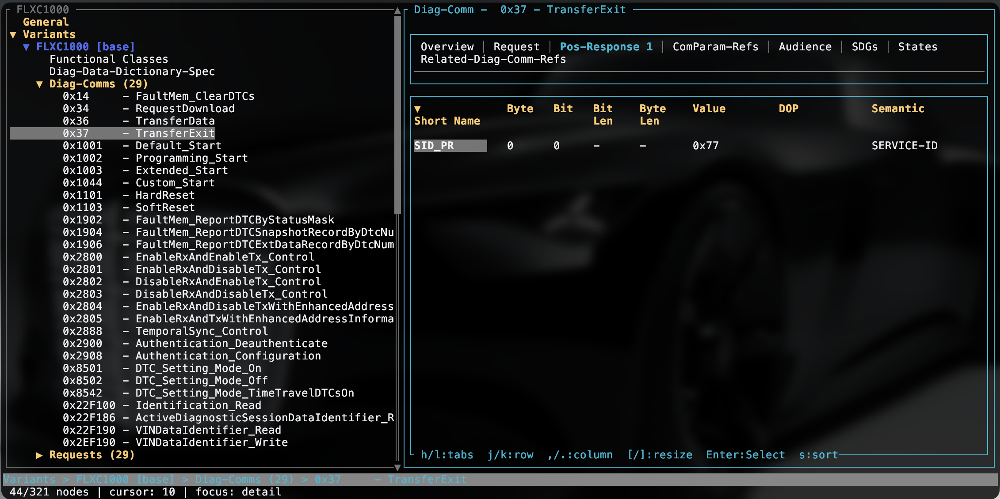

# MDD-UI - Diagnostic Database Viewer

A terminal-based user interface for browsing and exploring MDD (Marvelous Diagnostic Data) diagnostic databases. Built with Rust and [ratatui](https://ratatui.rs/), this tool provides an efficient way to navigate ECU diagnostic services, parameters, and metadata.

**DISCLAIMER** 
This tool is 99% vibe coded, and this is pretty visible in the codebase, anyhow it works, which is good enough for now.
This project is in early development and may contain bugs or incomplete features. 
Use at your own risk. Contributions and feedback are welcome to help improve the tool.

## Features



### 🎯 Core Functionality
- **Tree Navigation**: Browse ECU structure, variants, and diagnostic services
- **Multi-Tab Detail Panes**: View comprehensive information with table-based formatting across multiple tabs
- **Multi-Section Views**: Separate tabs for Request, Positive Response, and Negative Response
- **Advanced Search**: Hierarchical search stack system with scope filtering (All/Variants/Services/DiagComms)
- **Keyboard-First**: Vim-style navigation (h/j/k/l) with full keyboard control
- **Mouse Support**: Full mouse interaction including click-to-select, scrolling, and double-click to expand/show details

### 📊 Service Information Display
- Service ID and Sub-function ID with proper formatting
- Request and response parameters with full details
- Parameter types, positions, coded values, and semantics
- Data operation (DOP) information with popup details (press Enter on DOP rows)
- Visual separation with color-coded headers
- Customizable column widths with resize functionality

### 🔍 Search Features
- **Hierarchical Search Stack**: Build complex filtered views by chaining multiple searches
- **Search Scopes**: Filter by All, Variants, Services, or DiagComms sections
- **Search Navigation**: Jump between matches with `n`/`N`
- **Search Stack Management**: Clear entire search stack with `x`, pop last search with Backspace
- **Scope Cycling**: Switch search scope with Shift+S

### 🎨 Visual Features
- **Row-Level Navigation**: Select individual table rows with j/k
- **Highlighted Selection**: Dark gray background for selected rows
- **Parameter Headers**: Yellow + bold styling for easy identification
- **Visual Separators**: Horizontal lines between parameter groups
- **Adjustable Column Widths**: Use `[` and `]` to resize columns, `,` and `.` to switch focused column
- **Resizable Panes**: Adjust tree/detail pane split with `+`/`-` keys (20-80% range)
- **Scrollbars**: Indicators when content exceeds viewport
- **Tab Navigation**: Switch between detail tabs with h/l when detail pane is focused
- **DOP Popup**: Press Enter on DOP rows to view detailed information
- **Help Popup**: Press `?` to view keyboard shortcuts and controls

## Installation

### Prerequisites
- Rust 1.88 or later (edition 2024)

### Build from Source
```bash
git clone https://github.com/alexmohr/mdd-ui.git
cd mdd-ui
cargo build --release
```

The binary will be available at `target/release/mdd-ui`.

## Usage

```bash
mdd-ui <path-to-mdd-database>
```

### Example
```bash
# Load and browse an MDD database
mdd-ui /path/to/diagnostic.mdd

# Navigate with keyboard or mouse
# Press ? for help popup with all controls
```

### Keyboard Controls

#### Tree Navigation (Default Focus)
| Key | Action |
|-----|--------|
| `j` / `Down` | Move down |
| `k` / `Up` | Move up |
| `h` / `Left` | Collapse node or go to parent |
| `l` / `Right` | Expand node |
| `Space` | Toggle expand/collapse |
| `e` | Expand all nodes |
| `c` | Collapse all nodes |
| `s` | Toggle DiagComm sorting (by ID or by name) |
| `Home` | Jump to first node |
| `End` | Jump to last node |
| `PageUp` / `PageDown` | Page through nodes |

#### Detail Pane Navigation (When Focused)
| Key | Action |
|-----|--------|
| `j` / `Down` | Move to next row |
| `k` / `Up` | Move to previous row |
| `h` / `Left` | Switch to previous tab |
| `l` / `Right` | Switch to next tab |
| `Enter` | Show DOP popup (when on DOP row) |
| `Home` | Jump to first row in section |
| `End` | Jump to last row in section |
| `PageUp` / `PageDown` | Page through rows |
| `[` / `]` | Resize focused column (decrease/increase width) |
| `,` / `.` | Switch focused column (left/right) |

#### Search
| Key | Action |
|-----|--------|
| `/` | Start new search (adds to search stack) |
| `Enter` | Finalize search (while in search mode) |
| `n` | Next search match |
| `N` | Previous search match |
| `Shift+S` | Cycle search scope (All → Variants → Services → DiagComms) |
| `x` | Clear entire search stack |
| `Backspace` | Pop last search from stack (when search input is empty) |

#### General
| Key | Action |
|-----|--------|
| `Tab` | Toggle focus between tree and detail pane |
| `+` / `=` | Increase tree pane width (max 80%) |
| `-` / `_` | Decrease tree pane width (min 20%) |
| `m` | Toggle mouse support on/off |
| `?` | Show help popup with keyboard shortcuts |
| `q` / `Esc` | Quit (or close popup/search mode if open) |
| `Ctrl+C` | Force quit |

#### Mouse Controls (when enabled)
| Action | Effect |
|--------|--------|
| Click tree node | Select and focus tree node |
| Double-click tree node | Toggle expand/collapse |
| Click tab | Switch to that tab |
| Click detail row | Select that row |
| Double-click detail row | Show DOP popup (if applicable) |
| Scroll wheel | Scroll tree or detail pane |

## Structure

The UI is organized into three main areas:

### Tree View
- **ECU Level**: Top-level ECU information
- **Services**: Diagnostic services with SID and sub-function
- **Variants**: ECU variants (base and specific)
- **State Charts**: State machines and transitions
- **Jobs**: Single ECU jobs and their parameters
- **DiagComms**: Diagnostic communication sections (sortable by ID or name)
- **Inherited Services**: Services inherited from parent refs (shown in gray)

### Detail Panes
When a service is selected, the detail pane displays information in a tabbed interface:
- **Multiple Tabs**: Each section (Request, Positive Responses, Negative Responses) gets its own tab
- **Independent Navigation**: Each tab maintains its own scroll position and cursor
- **Service Details**: Overall service information
- **Request**: Request parameters with types and values
- **Positive Responses**: Success response parameters
- **Negative Responses**: Error response parameters
- **DOP Details**: Press Enter on rows with DOP information to view detailed popup

Each tab can be navigated independently using `h/l` keys when the detail pane is focused, and rows within tabs can be selected with `j/k`.


## Technical Details

### Dependencies
- **ratatui**: Terminal UI framework (v0.30.0)
- **crossterm**: Terminal manipulation (v0.29.0)
- **cda-database**: MDD database parsing and access (from eclipse-opensovd)
- **cda-interfaces**: MDD interface definitions (from eclipse-opensovd)
- **clap**: Command-line argument parsing
- **anyhow**: Error handling

### Architecture
- **Event-driven**: Responsive keyboard and mouse input handling
- **Stateful**: Maintains tree expansion, cursor positions, scroll states, and search stack
- **Efficient**: Only renders visible content
- **Flexible**: Table-based layout adapts to terminal size
- **Interactive**: Full mouse support with click, double-click, and scroll
- **Hierarchical Search**: Stack-based search system for complex filtering
- **Customizable**: Resizable columns and adjustable pane widths

## Development

### Building
```bash
cargo build
```

### Running in Development
```bash
cargo run -- <path-to-mdd-database>
```

### Key Features to Test
- Mouse support: Click nodes, tabs, and rows; scroll with mouse wheel
- Search stack: Use `/` to add searches, `x` to clear, Backspace to pop
- Column resizing: Use `[`/`]` to resize columns in detail pane
- Pane resizing: Use `+`/`-` to adjust tree/detail split
- Help popup: Press `?` to view all controls
- DOP popup: Press Enter on DOP rows to view details

## Contributing

Contributions are welcome! Areas for improvement:
- Additional detail views for other diagnostic elements
- Enhanced search capabilities and filtering
- Export functionality for diagnostic data
- Performance optimizations for very large databases
- Adding CI/CD from opensovd/cicd-workflows
- Code cleanup (clippy/fmt)

Please feel free to open issues or submit pull requests!

## License

MIT

## Credits

Built with:
- [ratatui](https://ratatui.rs/) - Terminal UI framework
- [crossterm](https://github.com/crossterm-rs/crossterm) - Terminal manipulation
- [cda-database](https://github.com/eclipse-opensovd/classic-diagnostic-adapter) - MDD database library
